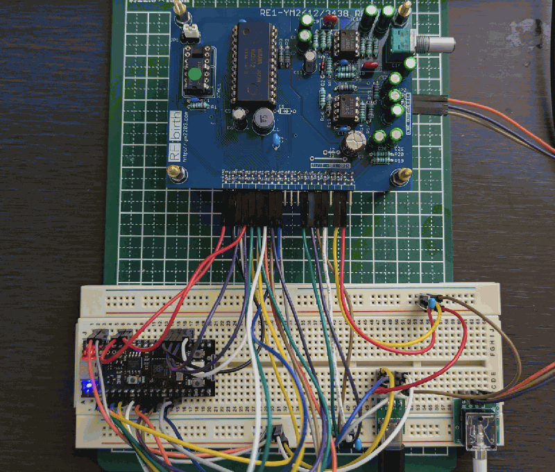
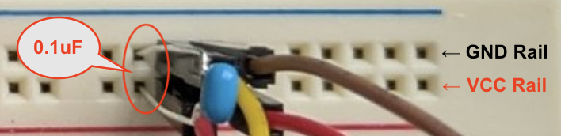

# RE1-YM2612 for Raspberry Pi Pico

Raspberry Pi Pico (RP2040) + PlatformIO + Arduino framework project for driving an RE1-YM2612 board with a minimal direct GPIO bus.

## Wiring



### RE1-YM2612 - Raspberry Pi Pico

| RE1-YM2612 | Raspberry Pi Pico |
| --- | --- |
| D0 | GPIO2 |
| D1 | GPIO3 |
| D2 | GPIO4 |
| D3 | GPIO5 |
| D4 | GPIO6 |
| D5 | GPIO7 |
| D6 | GPIO8 |
| D7 | GPIO9 |
| A0 | GPIO10 |
| A1 | GPIO11 |
| /WR | GPIO18 |
| /CS | GPIO19 |
| /IC | GPIO20 |
| /IRQ | GPIO21 (uses Pico internal pull-up) |
| /RD | GPIO28 |
| SCLK | GPIO29 |
| GND | GND |

### RE1-YM2612 - USB Bus

| RE1-YM2612 | USB Bus |
| ---------- | ------- |
| VCC        | VBUS    |
| AVCC       | VBUS    |
| GND        | GND     |
| AGND       | AGND    |

Please decouple VCC/GND (AVCC/AGND) using a 0.1uF multilayer ceramic capacitor, as shown below.



The capacitor should be connected between the VCC rail and the GND rail.

_Also, make sure that all connected devices share a common GND._

### RE1-YM2612 - 3.5mm Stereo

| RE1-YM2612  | 3.5mm Stereo |
| ----------- | ------------ |
| L (LineOut) | L            |
| R (LineOut) | R            |
| G (LineOut) | G            |

### 3.5mm Stereo - USB Bus

| 3.5mm Stereo | USB Bus |
| ------------ | ------- |
| GND          | GND     |

### RaspberryPi Pico - USB Bus

| Rapberry Pi Pico | USB Bus |
| ---------------- | ------- |
| VSYS (Vin)       | VBUS    |
| GND              | GND     |

### RaspberryPi Pico - User LED

| Rapberry Pi Pico | User LED |
| ---------------- | -------- |
| GPIO25           | Anode/Cathode via current-limiting resistor |
| GND / 3V3(OUT)   | Cathode/Anode |

Wire the user LED as a normal 3.3V GPIO LED circuit. Do not connect `GPIO25` directly to `VBUS` (+5V).

> If you are using the YD-RP2040, a Raspberry Pi Pico-compatible module, this wiring is not necessary because the LED next to the power LED (red) is connected to GPIO25 by default.

## YM2612

```
         a        a
  φM  V  V  L  R  G  A1 A0 RD WR CS IRQ
   |  |  |  |  |  |  |  |  |  |  |  |
  24 23 22 21 20 19 18 17 16 15 14 13
+-------------------------------------+
|                                     |
\               YAMAHA                |
/               YM2612                |
|                                     |
+-------------------------------------+
   1  2  3  4. 5  6  7  8  9 10 11 12
   |  |                    |  |  |  |
   G  +--------------------+ nc IC  G
         Data (D0 ... D9)
```

### Pin Functions

| No. | Pin Name | I/O | Function |
|---:|---|---|---|
| 1 | GND | - | Ground pin. |
| 2 | D0 | I/O | 8-bit bidirectional data bus. Communicates data with the processor. |
| 3 | D1 | I/O | 8-bit bidirectional data bus. Communicates data with the processor. |
| 4 | D2 | I/O | 8-bit bidirectional data bus. Communicates data with the processor. |
| 5 | D3 | I/O | 8-bit bidirectional data bus. Communicates data with the processor. |
| 6 | D4 | I/O | 8-bit bidirectional data bus. Communicates data with the processor. |
| 7 | D5 | I/O | 8-bit bidirectional data bus. Communicates data with the processor. |
| 8 | D6 | I/O | 8-bit bidirectional data bus. Communicates data with the processor. |
| 9 | D7 | I/O | 8-bit bidirectional data bus. Communicates data with the processor. |
| 10 | TEST | I/O | Pin to test this LSI. Do not connect. |
| 11 | /IC | I | Initializes the internal register. |
| 12 | GND | - | Ground pin. |
| 13 | /IRQ | O | Interrupt signal issued from the two timers. When the time programmed into the timer has elapsed, this goes low. Output with open drain. |
| 14 | /CS | I | Control input. See control table below. |
| 15 | /WR | I | Control input. See control table below. |
| 16 | /RD | I | Control input. See control table below. |
| 17 | A0 | I | Control input. See control table below. |
| 18 | A1 | I | Control input. See control table below. |
| 19 | A.GND | - | Ground pin. |
| 20 | MOR | O | Two-channel analog outputs. These are output with a source follower. |
| 21 | MOL | O | Two-channel analog outputs. These are output with a source follower. |
| 22 | A.Vcc | - | +5V power supply pins. |
| 23 | Vcc | - | +5V power supply pins. |
| 24 | φM | I | Master clock input. |

### Control Table

| /CS | /RD | /WR | A1 | A0 | Details |
|---:|---:|---:|---:|---:|---|
| 0 | 1 | 0 | 0 | 0 | Writes register addresses of timers, etc. |
| 0 | 1 | 0 | 0 | 1 | Writes register addresses of channels 1-3. |
| 0 | 1 | 0 | 1 | 0 | Writes register data of timers, etc. |
| 0 | 1 | 0 | 1 | 1 | Writes register data of channels 1-3. |
| 0 | 1 | 0 | 1 | 0 | Writes register addresses of channels 4-6. |
| 0 | 1 | 0 | 1 | 1 | Writes register data of channels 4-6. |
| 0 | 0 | 1 | 0 | 0 | Reads status. |
| 1 | X | X | X | X | D0-D7 are set to high-impedance. |

## Project layout

- `platformio.ini`: PlatformIO environment for Raspberry Pi Pico with the Arduino framework.
- `src/YM2612Bus.hpp`: Safe digitalWrite-based 8-bit bus access layer.
- `src/YM2612.hpp`: YM2612 device abstraction layer built on top of the bus.
- `src/VGMPlayer.hpp`: VGM parser/player that executes YM2612 writes and wait commands.
- `src/rom_song.hpp`: Embedded VGM byte array generated from `vgm/song.vgm`. (Use the [update_song.sh](./update_song.sh))
- `src/main.cpp`: Startup sequence, serial logging, and playback loop.

## Design notes

- The bus layer and YM2612 layer are separated so the register-level API stays reusable from the VGM player and from future higher-level playback code.
- Data lines D0-D7 are driven with `digitalWrite()` for conservative and predictable behavior.
- `/CS`, `/WR`, and `/RD` are treated as active-low control lines.
- `/IC` is exposed through `resetChip()` and used during startup.
- `SCLK` is generated by RP2040 PWM on GPIO29 at approximately 7.67 MHz for the RE1 clock input.
- YM2612 write timing is intentionally aligned with `vgmplayer-rpi-re-c`: the firmware waits after both the address phase and the data phase.
- `A2`, `A3`, and `EXSEL0-3` are intentionally left unconnected in the current single-chip wiring.
- VGM playback runs as a small state machine in `loop()` and currently implements:
  - YM2612 register writes (`0x52`, `0x53`)
  - wait commands (`0x61`, `0x62`, `0x63`, `0x70-0x7F`, `0x80-0x8F`)
  - loop/end handling (`0x66`)
  - skipping of unrelated chip commands that appear in the source VGM
- Port selection uses `A1`:
  - `port = 0` drives `A1 = LOW`
  - `port = 1` drives `A1 = HIGH`
- Register address vs. data phase uses `A0`:
  - address write drives `A0 = LOW`
  - data write drives `A0 = HIGH`

## Build and upload

1. Install [PlatformIO](https://platformio.org/).
2. Open this directory in VS Code with the PlatformIO extension, or use the CLI.
3. Build:

```sh
pio run
```

4. Upload:

```sh
pio run -t upload
```

5. Open the serial monitor:

```sh
pio device monitor -b 115200
```

## Startup behavior

At boot, `setup()` does the following:

1. Starts `Serial` at `115200`.
2. Logs the active pin mapping.
3. Initializes the GPIO bus.
4. Pulses `/IC` low for 1 ms to reset the YM2612, then waits 1 ms for recovery.
5. Applies a few safe default registers:
   - disable LFO
   - reset timer control
   - disable DAC
   - key-off all 6 channels
6. Parses the embedded `rom_song` VGM header and logs version/data offsets.
7. Starts playback.

`loop()` repeatedly calls the VGM player, which executes YM2612 writes immediately and schedules wait commands using `micros()`.

## Extending toward a VGM player

The current structure is designed so you can later add:

- a higher-performance bus backend while keeping the same chip API
- channel helpers for instrument setup and note-on/note-off control
- support for more VGM command types if you need additional chips or PCM features
